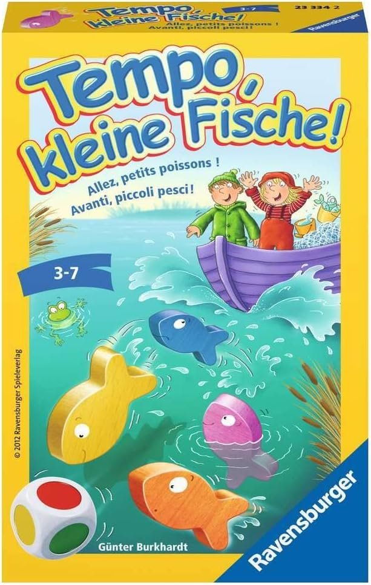
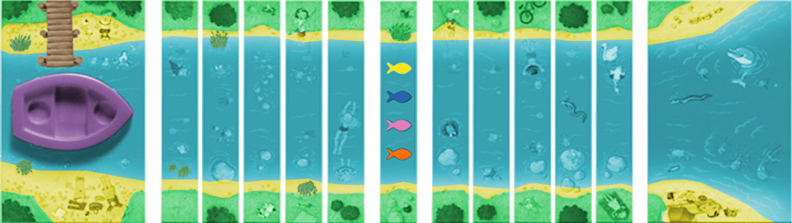

# Tempo, Kleine Fische!

## Table of Contents

- [Introduction](#introduction)
- [Game Description](#game-description)
- [Strategies Implemented](#strategies-implemented)
- [Code](#code)
- [Results](#results)

---

## Introduction

 **"Tempo, kleine Fische!"** is a board game that you can play with your 3-7 year kids. The repo is to analyze the probabilities of different game outcomes under different strategies with simulation.

## Game Description

The game board consists of a river with sections leading to the sea. Players roll a die to determine which piece moves:

- **Fish Colors**: Blue, Yellow, Orange, and Purple.
- **Fisherman Colors**: Red and Green.
- **Gameplay**:
  - **Fish Movement**: When a fish's color is rolled, that fish moves forward one space.
  - **Fisherman Movement**: When Red or Green is rolled, the fisherman moves forward, removing a river section and potentially catching fish.
  - **Catching Fish**: If a fish is on the section being removed, it is caught, and its color now aids the fisherman.
  - **Saved Fish**: When a fish reaches the sea, rolling its color allows moving any remaining fish.

## Strategies Implemented

When a fish reaches the sea, rolling its color allows moving any remaining fish. Two strategies can be applied:

### Strategy 1: Move Fish Furthest from the Sea

This strategy prioritizes moving the fish that is furthest from safety, aiming to reduce the risk of any fish being caught.

### Strategy 2: Move Fish Nearest to the Sea

This strategy focuses on moving the fish closest to the sea, attempting to secure a saved fish as quickly as possible.

## Code
[code](./simulation.ipynb)

## Results

After running the simulation with 100,000 games for each strategy, the following results were observed:

### Strategy 1 Results

- **Fish Win**: 36.02%
- **Fisherman Win**: 52.75%
- **Draw**: 11.23%

### Strategy 2 Results

- **Fish Win**: 36.20%
- **Fisherman Win**: 50.68%
- **Draw**: 13.12%
